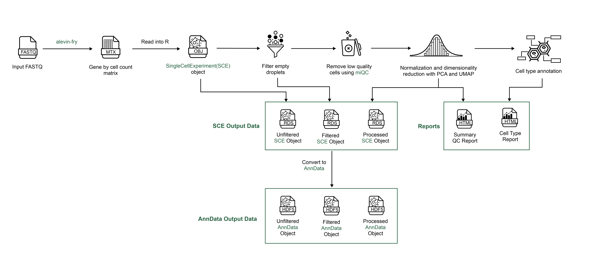

# scpca-nf

This repository holds a [Nextflow](https://www.nextflow.io) workflow (`scpca-nf`) that is used to process 10x single-cell data as part of the [Single-cell Pediatric Cancer Atlas (ScPCA) project](https://scpca.alexslemonade.org/).
All dependencies for the workflow outside of the Nextflow workflow engine itself are handled automatically; setup generally requires only organizing the input files and configuring Nextflow for your computing environment.
Nextflow will also handle parallelizing sample processing as allowed by your environment, minimizing total run time.

The workflow processes fastq files from single-cell and single-nuclei RNA-seq samples using [alevin-fry](https://alevin-fry.readthedocs.io/en/latest/) to create gene by cell matrices.
The workflow outputs gene expression data in two formats: as [`SingleCellExperiment` objects](https://www.bioconductor.org/packages/release/bioc/html/SingleCellExperiment.html) and as [`AnnData` objects](https://anndata.readthedocs.io/en/latest/).
Reads from samples are aligned using selective alignment, to an index with transcripts corresponding to spliced cDNA and to intronic regions, denoted by alevin-fry as `splici`.
These matrices are filtered and additional processing is performed to calculate quality control statistics, create reduced-dimension transformations, assign cell types using both [`SingleR`](https://bioconductor.org/packages/release/bioc/html/SingleR.html) and [`CellAssign`](https://docs.scvi-tools.org/en/stable/user_guide/models/cellassign.html), and create output reports.
`scpca-nf` can also process libraries with ADT tags (e.g., CITE-seq), multiplexed libraries (e.g., cell hashing), bulk RNA-seq, and spatial transcriptomics samples.

For more information on the contents of the output files and the processing of all modalities, please see the [ScPCA Portal docs](https://scpca.readthedocs.io/en/latest/).

## Using scpca-nf to process your samples

The default configuration of the `scpca-nf` workflow is currently set up to process samples as part of [the ScPCA portal](https://scpca.alexslemonade.org/) and requires access to AWS through the Data Lab.
For all other users, `scpca-nf` can be set up for your computing environment with a few configuration files.
| [Instructions for using `scpca-nf`](external-instructions.md) |
| ------------------------------------------------------------- |

:warning: Please note that processing single-cell and single-nuclei RNA-seq samples requires access to a high performance computing (HPC) environment with nodes that can accommodate jobs requiring up to 24 GB of RAM and 12 CPUs.

To run `scpca-nf` on your own samples, you will need to complete the following steps:

1. [Organize your files](external-instructions.md#file-organization) so that each folder contains fastq files relevant to a single sequencing run.
2. [Prepare a run metadata file](external-instructions.md#prepare-the-run-metadata-file) with one row per library containing all information needed to process your samples.
3. [Prepare a sample metadata file](external-instructions.md#prepare-the-sample-metadata-file) with one row per sample containing any relevant metadata about each sample (e.g., diagnosis, age, sex, cell line).
4. Set up a [configuration file](external-instructions.md#configuration-files), including the [definition of a profile](external-instructions.md#setting-up-a-profile-in-the-configuration-file), dictating where Nextflow should execute the workflow.

You may also [test your configuration file using example data](examples/README.md).

For ALSF Data Lab users, please refer to the [internal instructions](internal-instructions.md) for how to run the workflow on our systems.
